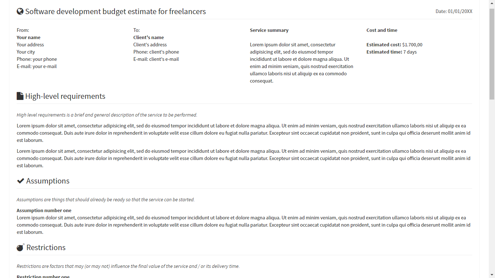

# Software development budget estimate template for freelancers

This is a simple html page (styled with Bootstrap and using Font Awesome icons) to be used as a budget estimate for your next client's project. This tamplate is based of one page from the [AdminLTE template](https://github.com/almasaeed2010/AdminLTE).

## Demo

You can checkout the template in [my web site](http://artenes.github.io/budget-estimate-template).

## Description

More than just giving a price, you can give some details about how the project will work. In this template there are some sections where you can organize the details and requirements of your next project.

## Price

And when the price part comes, you can organize it in a table of activities and give some details about how the client is suposed to pay for your services.